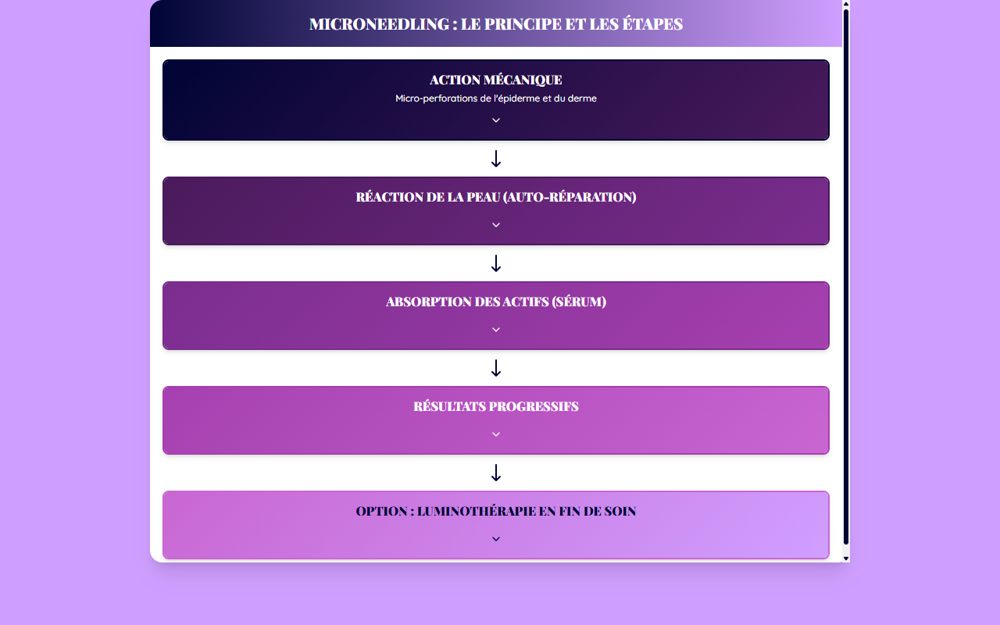

# Récapitulatif — LE MICRONEEDLING Slide 9

**Course:** LE MICRONEEDLING  
**Slide:** 9  
**Live URL:** https://microneedling-recapitulatif.edtechiecorp.com  
**Stack:** Next.js · Tailwind CSS · TypeScript · GitHub Pages  

## What this slide does

Summary and recap slide for the microneedling course, consolidating all the key concepts, techniques, and safety protocols covered throughout the module. At slide 9, learners are near the end of the course and use this content to reinforce their learning before completing any final assessment. The recap format helps with retention by presenting information in a structured, condensed format.

## Screenshot

## Usage

This slide is embedded as an iframe inside Coassemble at the live URL above. DNS is managed via Cloudflare (`edtechiecorp.com`). To update the slide, push to the `main` branch — GitHub Actions will rebuild and redeploy automatically.
